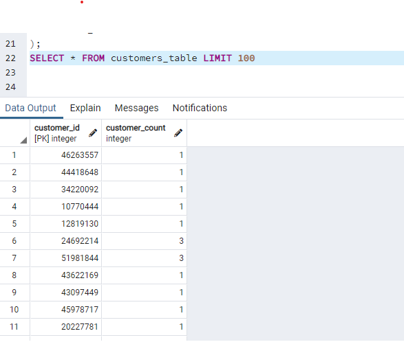

##### amazon_vine_analysis_UT_DATA

# Overview of the analysis: Explain the purpose of this analysis

Since your work with Jennifer on the SellBy project was so successful, you’ve been tasked with another, larger project: analyzing Amazon reviews written by members of the paid Amazon Vine program. The Amazon Vine program is a service that allows manufacturers and publishers to receive reviews for their products. Companies like SellBy pay a small fee to Amazon and provide products to Amazon Vine members, who are then required to publish a review.

In this project, you’ll have access to approximately 50 datasets. Each one contains reviews of a specific product, from clothing apparel to wireless products. You’ll need to pick one of these datasets and use PySpark to perform the ETL process to extract the dataset, transform the data, connect to an AWS RDS instance, and load the transformed data into pgAdmin. Next, you’ll use PySpark, Pandas, or SQL to determine if there is any bias toward favorable reviews from Vine members in your dataset. Then, you’ll write a summary of the analysis for Jennifer to submit to the SellBy stakeholders.

# Results

- How many Vine reviews and non-Vine reviews were there?
  - **Vine 378 reviews**
  - **Non-Vine 48831 reviews**
- How many Vine reviews were 5 stars? How many non-Vine reviews were 5 stars?
  - **Vine 171 reviews**
  - **Non-Vine 22967 reviews**
- What percentage of Vine reviews were 5 stars? What percentage of non-Vine reviews were 5 stars?
  - **Vine 0.75%**
  - **Non-Vine 99.25%**

## Summary

**Yes there is positivity bias. An additional analysis could be done to filter for only verified purchasers of the product.**

# Deliverable 1

